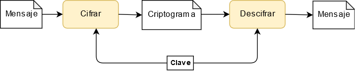

# Cifrado clásico

Colección implementación de algoritmos de cifrados.

## Clasificación de cifrados

Todo los cifrados mostrados son simétricos, es decir, el emisor y receptor deben tener la misma clave.

<p align="center">
    
<p\>

## Esquema general

<p align="center">
    
<p\>

- El emisor quiere enviar un mensaje de manera segura, sin que ninguno tercero pueda leerlo, solamente el receptor..
- El mensaje en texto plano se cifra mediante una clave con un algoritmo de cifrado simétrico.
- Como resultado se obtiene un criptograma, que es enviado por un canal inseguro.
- Una vez el receptor obtiene el criptograma, este lo descifra con la misma clave que la del emisor mediante un algoritmo descifrado, obteniendo el texto plano.

## Módulos utilizados

- numpy

## Instalar dependencias

```shell
$ pip install -r requirements.txt
```